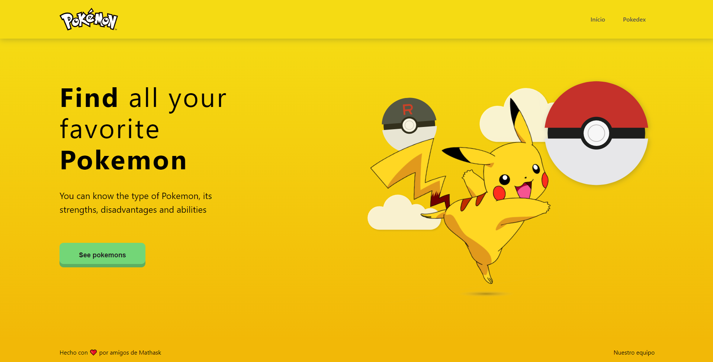
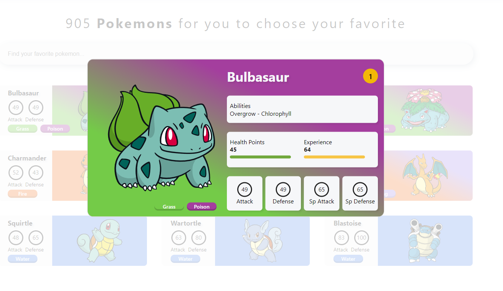

# Pokedex-react

### Home

### Pokedex

### Detalhe do pokemon

> Projeto desenvolvimento para consultar a API pública do pokemon. É uma pokedex, pesquise seu pokemon favorito.

## 💻 Pré-requisitos

Antes de começar, verifique se você atendeu aos seguintes requisitos:

- Você tem uma máquina `Windows / Linux / Mac`?
- Você instalou o [`Node`](https://nodejs.org/en/) em sua máquina?
- Você instalou o [`Yarn`](https://yarnpkg.com/) em sua máquina?

## 🚀 Instalando Pokedex-react

Para instalar o Pokedex-react, siga estas etapas:

1. Clone o repositório do projeto: `git clone https://github.com/EXtreme-go-horse-club/pokedex-app.git`.
2. Na raiz do projeto rode o comando `yarn` para instalar as dependências.

## ☕ Rodando o Pokedex-react

Para rodar o Pokedex-react, siga estas etapas:

1. Execute o comando `yarn start` na raiz do projeto após ter instalado as dependências.

> Obs.: O projeto será executado em `http://localhost:3000/`.

## 🤝 Colaboradores

Agradecemos às seguintes pessoas que contribuíram para este projeto:

<table>
  <tr>
    <td align="center">
      <a href="https://github.com/EduardoMarquesCardozo">
         
        
          <b>Eduardo Marques Cardozo</b>
        
      </a>
    </td>
    <td align="center">
      <a href="https://github.com/guilhermeafonsomb">
         
        
          <b>Guilherme Afonso</b>
        
      </a>
    </td>
    <td align="center">
      <a href="https://github.com/msalarini">
         
        
          <b>Marcus Salarini</b>
        
      </a>
    </td>
    <td align="center">
      <a href="https://github.com/disgnr">
         
        
          <b>Diego Velazquez</b>
        
      </a>
    </td>
    <td align="center">
      <a href="https://github.com/MCastegnaro">
         
        
          <b>Matheus Castegnaro</b>
        
      </a>
    </td>
  </tr>
</table>
